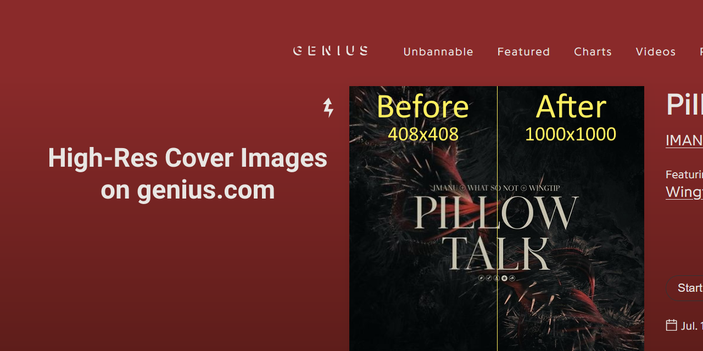

  
  
#### Userscript that changes all cover images on genius.com lyrics pages to their highest possible resolution.
Also available on [greasyfork](#TODO) and [openuserjs.](#TODO)

 

### Installation:
1. Install a userscript browser extension like Violentmonkey ([Firefox](https://addons.mozilla.org/en-US/firefox/addon/violentmonkey/), [Chrome](https://chrome.google.com/webstore/detail/violentmonkey/jinjaccalgkegednnccohejagnlnfdag), [Edge](https://microsoftedge.microsoft.com/addons/detail/violentmonkey/eeagobfjdenkkddmbclomhiblgggliao?hl=en-GB&gl=DE))
2. [Click here to install the userstyle](https://github.com/Sv443/High-res-cover-images-on-genius.com/raw/refs/heads/main/High-Res-Cover-Images.user.js)

  

Made with :heart: by Sv443 - please consider [supporting the development](https://github.com/sponsors/Sv443)  
Licensed under the [MIT license](./LICENSE.txt)

